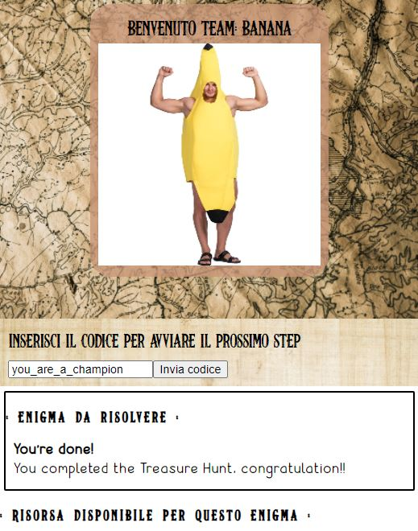

# treasure-hunt Project

This project uses Quarkus, the Supersonic Subatomic Java Framework.

If you want to learn more about Quarkus, please visit its website: https://quarkus.io/ .

## How it works

The treasure hunt program is fully configurable via files inside _/conf_ folder.

Select a physical field for the searcher, select the location where hide the step progression and config the application in order to provide to the team the puzzles and if you want some help tips.

### How should be the treasure hunting

Select the player teams and provide them a secret pass code.

> e.g.<br>
> Luca - Leo --> Team = 'Banana' -> Pass code = 'yellow'<br>
> Alberto - Andy --> Team = 'Kiwi' -> Pass code = 'green'<br>
> Mario - Matthew --> Team = 'Raspberry' -> Pass code = 'red'

Now the team can login with their device to your server via home page:


Additional to team pass code you need to provide the first secret word in order to start the search.
The secret step password that you will provide will load from configurations the first enigma and the eventually tip.

> e.g.<br>
> You provide the first step password: welcome_players<br>
> The teams insert the password into their homepage


Now in the homepage all teams can see the enigma related to the passcode (related to step 'ex1')

> e.g.<br>
> An enigma without tips must be resolved!<br>
> Banana team understand the solution and run in the kitchen to check inside the microwave.<br>
> A new pass code found, it said "well_done"

After found the next passcode the team can proceed to next puzzle (next to step 'ex2')


For step 2 an image with a textual resource tips was showed on homepage

> e.g.<br>
> The image is a Rebus to resolve<br>
> The tips indicate what a rebus is<br>
> Banana team have the solution: 'chair', indeed under a dinner room's chair is placed a paper with new pass code: "you_are_a_champion"

Done! With this last pass code the team win the treasure hunt!



## Configuration instructions

In order to config your game you need to create od download the runnable uber-jar. Download it from tags package or build it following the Packaging instructions.

place in the same folder the jar and the conf folder

### The conf folder structure

The structure for your conf folder should be:

```
conf
|---steps
|   |---ex1
|   |---ex2
|   |---ex3
|
|---users
    |---User1
    |---User2
    |---User3
    |---User4
    |---User5
    |---users.properties

```

**step** : will contains all steps of your treasure hunt
**users** : will contains the User information and the avatars.

all of these are folder, let's check the contents.

#### users.properties

Will contains the name for team and the secret team pass code, for example:

```properties
key=value
team_name=secret_pass_code
User1=secret1
User2=secret2
User3=secret3
```

The team need a folder with the same name in the key properties (e.g. User1), in this folder you can place a little image with name _avatar.jpg_. This will be showed in the Team home page.

#### steps folder

Place here all steps that will form the treasure hunt, the inner files will be:

##### info.json

A simple JSON that indicate the enigma file source, the step number and a little description about it.

If the file is an image wrote the file name in the `enigmaImageFile` (e.g. enigma.jpg). Else if the file is a textual use the `enigmaTextFile` field in JSON, use txt or HTML file.

```json
{
	"result": "1",
	"description": "enigma description",
	"enigmaTextFile": "enigma.htm",
	"enigmaImageFile": ""
}
```

##### Enigma file

In the example the names are "enigma.jpg" or "enigma.txt" but you can use any name and link it in the JSON file.

The images supported are PNG JPG and GIF. No videos are supported.

##### passcode.txt

A simple and small textual file that contains the pass code for load the step, for example the pass code in ex1 folder will load the enigma file in the same folder (ex1).

##### resource file

You can add an optional file, the resource.

This file will add tips to the player in order to help or explain something.

The file name must be always resource and the extensions supported are:
 - jpg
 - png
 - txt
 - htm
 - html
 - pdf

***

You can check the conf folder saved in github if you want an example.

___

## Quarkus specifications

### Running the application in dev mode

You can run your application in dev mode that enables live coding using:

```shell script
./gradlew quarkusDev
```

> **_NOTE:_**  Quarkus now ships with a Dev UI, which is available in dev mode only at http://localhost/q/dev/.

### Packaging and running the application

The application can be packaged using:
```shell script
./gradlew build
```
It produces the `treasure-hunt-1.0.0-runner.jar` inside _build_ folder.

The application is now runnable using `java -jar treasure-hunt-1.0.0-runner.jar`.

